# Game Shop

A full-stack web application for exploring and purchasing games, featuring user authentication, catalog browsing, shopping cart, Stripe payments, and a personal game library.

## Technologies Used

### Frontend
* **Next.js 15** (App Router)
* **TypeScript**
* **Tailwind CSS**
* **Zustand** (state management)

### Backend
* **Django** & **Django REST Framework**
* **PostgreSQL**
* **Celery** (in-memory broker for development — no Redis required)

### Integrations
* **Stripe** (Checkout & Subscriptions)

## Run Instructions

### Prerequisites
* Node.js 18+ and npm
* Python 3.10+
* PostgreSQL

### Backend Setup
```bash
cd backend
python -m venv venv
venv\Scripts\activate          # Windows
# source venv/bin/activate     # macOS/Linux
pip install -r requirements.txt

cp .env.example .env
# Fill in DATABASE_URL, SECRET_KEY, STRIPE_SECRET_KEY, etc.

python manage.py migrate
python manage.py createsuperuser
python manage.py seed_games      # Optional: seed 12 popular games

python manage.py runserver
```

> **Note:** No Redis or RabbitMQ needed in development. Celery uses an in-memory broker automatically.

### Frontend Setup
```bash
cd frontend
npm install

# Create .env.local with:
# NEXT_PUBLIC_API_URL=http://localhost:8000/api/v1
# NEXT_PUBLIC_STRIPE_PUBLISHABLE_KEY=your_stripe_publishable_key

npm run dev
```


## Screenshots

### Homepage
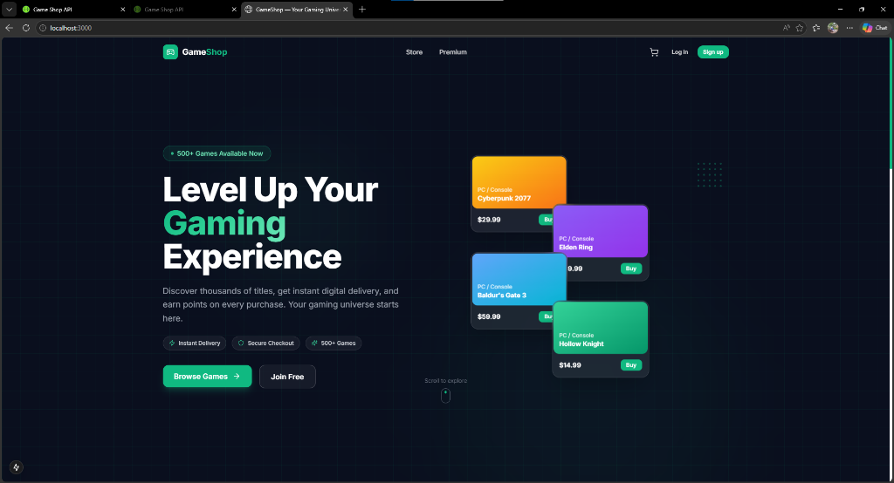

### Featured Games
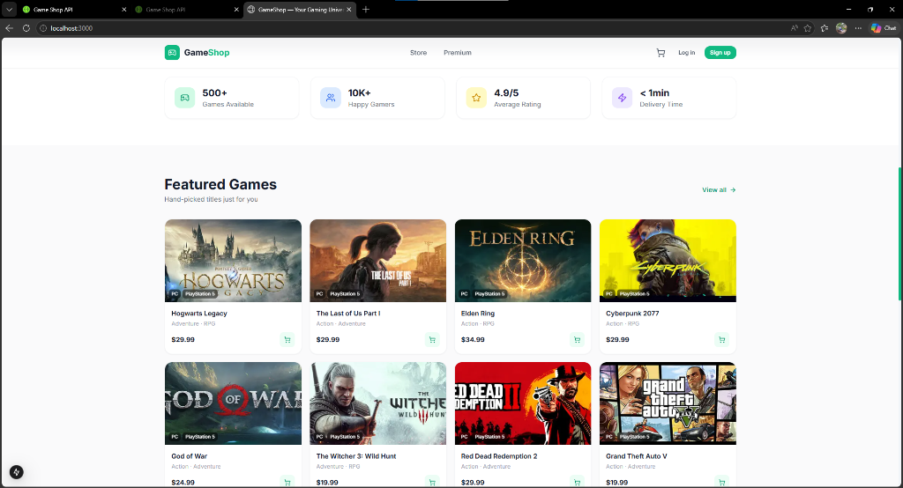

### Browse by Genre & Premium Membership
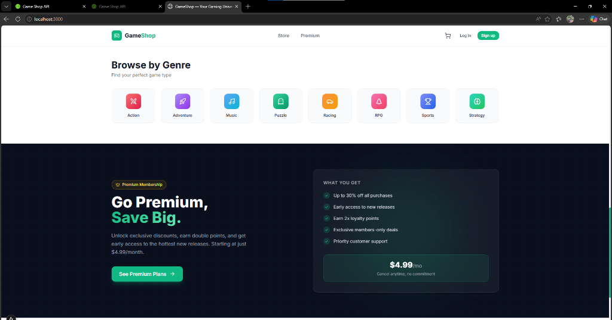

### Register / Create Account
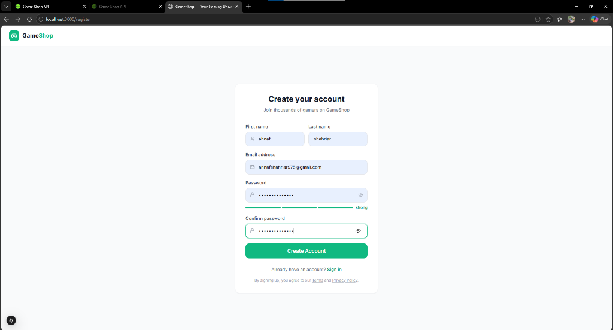

### Login
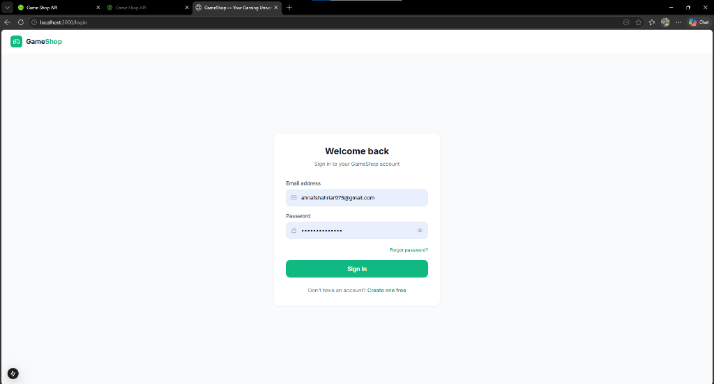

### Catalog
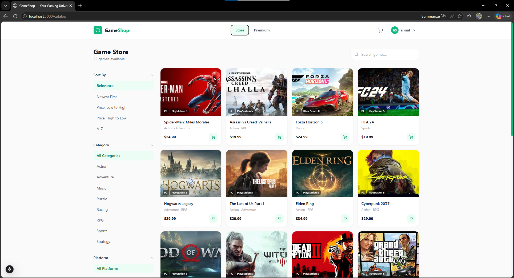

### Cart
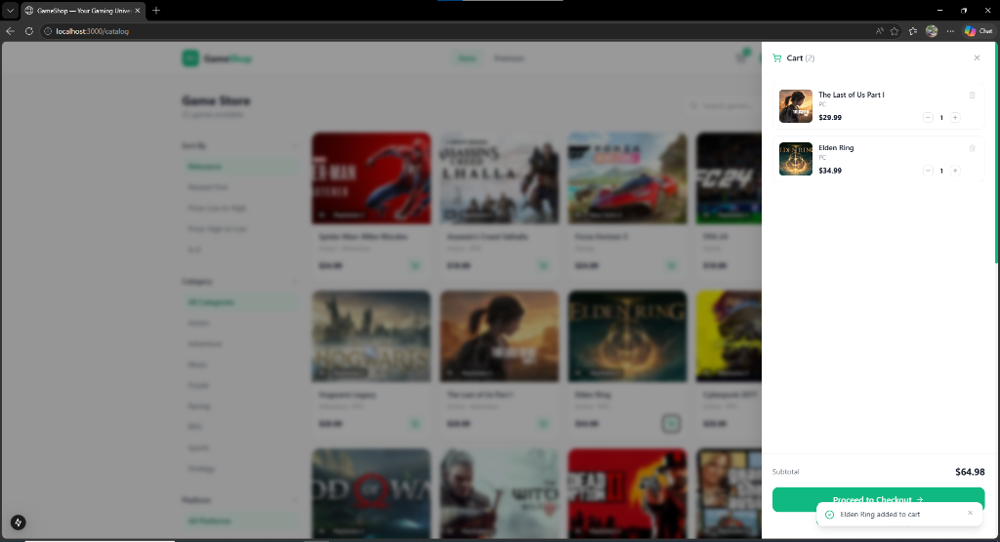

### Checkout
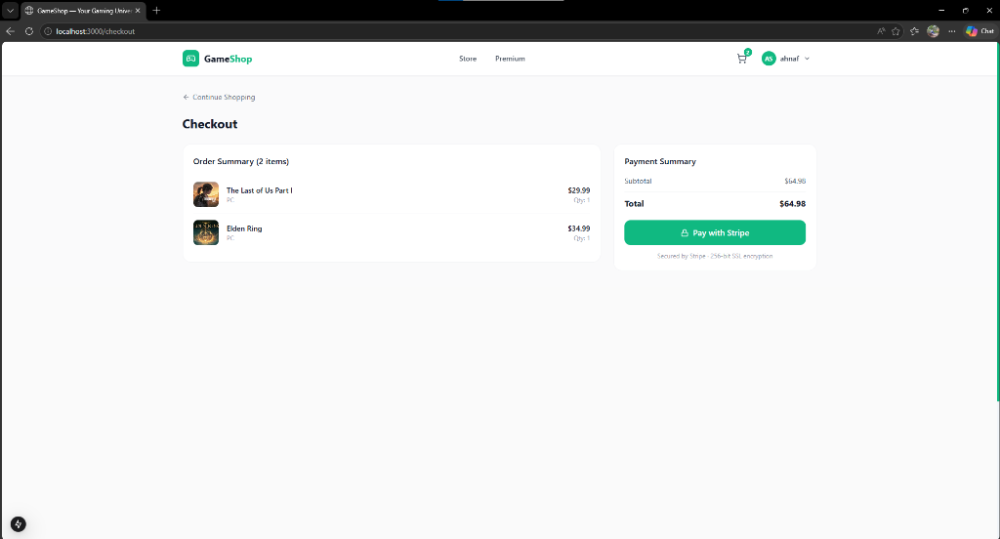

### Stripe Payment
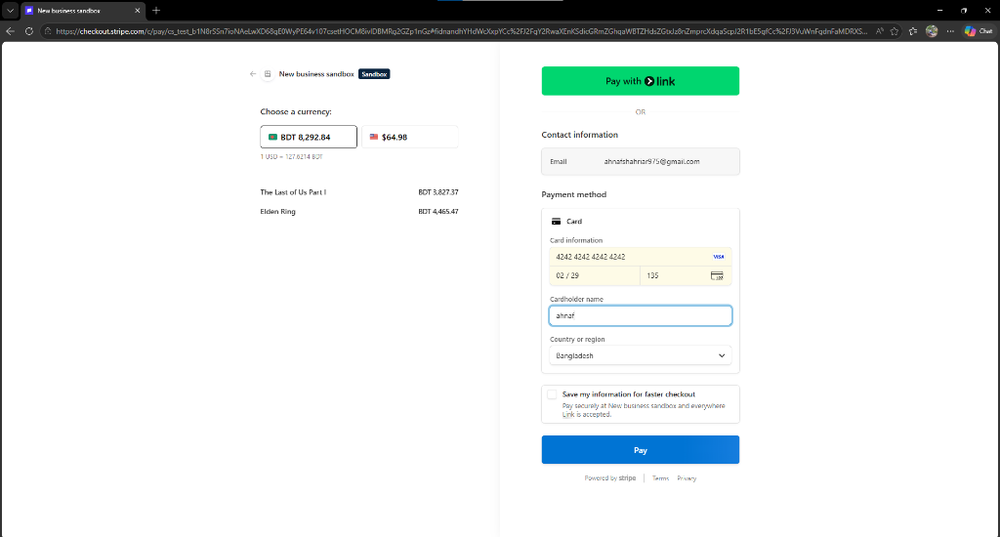

### Payment Success
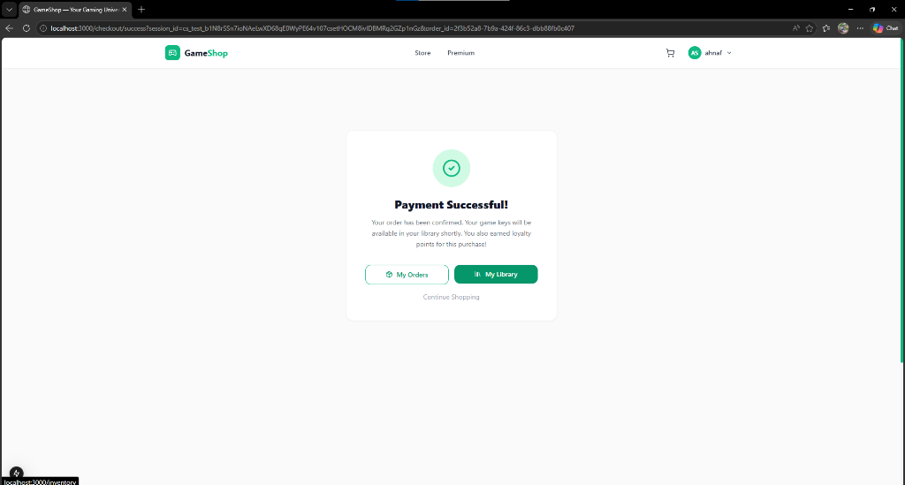

### My Library
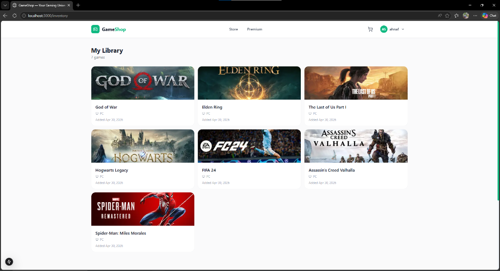
